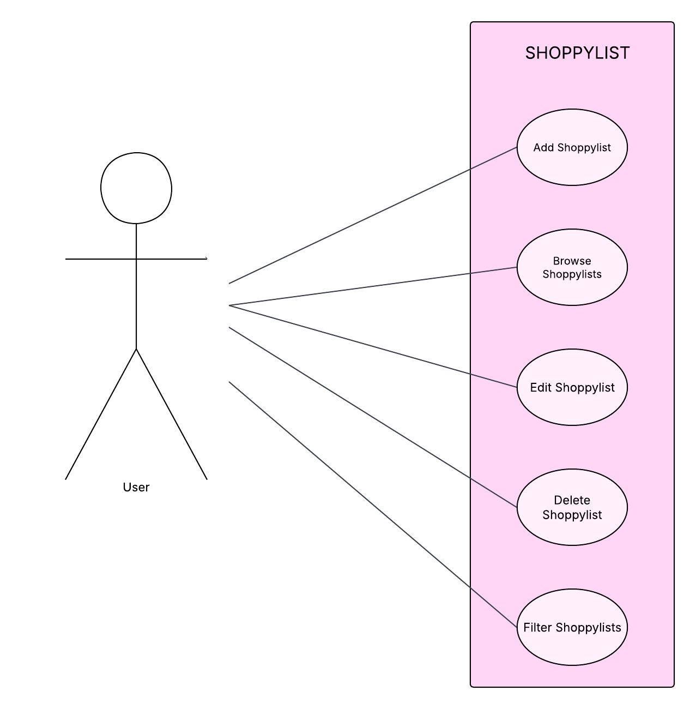

# ShoppyList

## Opis projekta

ShoppyList je web aplikacija za stvaranje, uređivanje i dohvaćanje shopping listi.

Aplikacija omogućuje korisniku kreiranje shopping listi po trgovinama, dodavanje i upravljanje sa proizvodima unutar listi, označavanje kupljenih proizvoda, filtriranje shopping listi prema trgovinama te grafički prikaz najčešće posjećenih trgovina.

Projekt je izrađen korištenjem Flask web okvira, PonyORM-a i SQLite baze podataka.

---

## Use Case Diagram



---

## Korištene tehnologije

* Python
* Flask
* PonyORM
* SQLite
* HTML
* Bootstrap
* Jinja
* Chart.js
* Docker

---

## Funkcionalnosti

### Upravljanje shopping listama

* Dodavanje nove shopping liste
* Pregled svih shopping lista
* Filtriranje shopping lista po trgovini
* Brisanje shopping lista

### Upravljanje proizvodima

* Dodavanje proizvoda na shopping listu
* Pregled proizvoda pojedine liste
* Check-box za označavanje kupljenih proizvoda
* Brisanje proizvoda sa shopping liste

### Statistika

* Prikaz najčešće pojećenih trgovina
* Grafički prikaz statistike pomoću Chart.js biblioteke

---

## Model podataka

### ShoppingLista

* id
* trgovina
* datum

### Proizvod

* id
* naziv
* kolicina
* kupljeno
* lista (FK)

---

## Instalacija

### Kloniranje repozitorija

```bash
cd ~/Downloads
git clone <url-repozitorija>
cd Shoppylist
```

---

## Docker tutorial

```bash
docker build -t shoppylist .
docker ps
docker run -p 5000:5000 shoppylist
```

Aplikacija će biti dostupna na:

```text
http://localhost:5000
```

---

